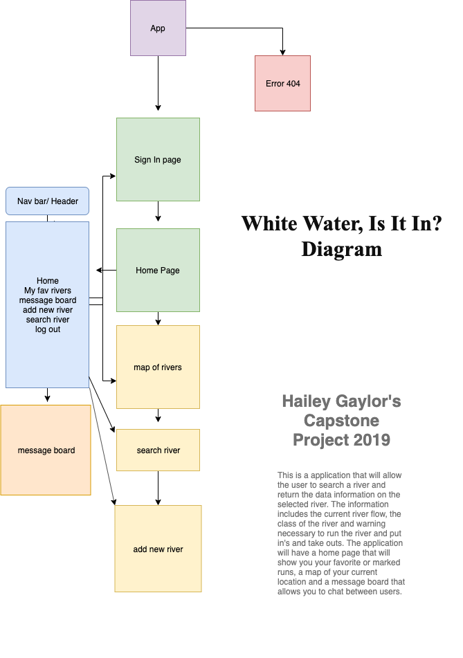

# _White Water, Is It In?_

#### _A recreational application for white water sports._

#### By _**Hailey Gaylor**_

### Flow Chart

### WireFraming model 
https://xd.adobe.com/view/38e6fe4f-424b-4adf-79d8-79f8f321859b-4ed7/
## Description

_The Application will allow a person to search and  view a river for white water sports. The data will return the current flow, put in and take out's with gps locations, class of river, length of river and special features._

## Setup/Installation Requirements

- Open the terminal and navigate to the desktop.
- Run the command $ git clone https://github.com/Hgaylor0220/WhiteWaterIsItIn.
- Navigate into the project folder and run the command $ npm -y
- in the command line run $ npm i . This will install required packages.
- In the command line $ npm run start to view the project. 

## Using a debugger
- Debuggers are all set up for this project. If you would like to add addition code to this project using the linter run the command $ eslint -- init. 
- to set the linter configurations follow these steps:
- ? Are you using ECMAScript 6 features? Yes
- ? Are you using ES6 modules? Yes
- ? Where will your code run? Browser
- ? Do you use CommonJS? No
- ? Do you use JSX? Yes
- ? Do you use React? Yes
- ? What style of indentation do you use? Spaces  
- ? What quotes do you use for strings? Single
- ? What line endings do you use? Unix (select windows if you are a window user)
- ? Do you require semicolons? Yes
- ? What format do you want your config file to be in? JSON
- To fix linter errors run the command 

- once youve completed these steps your linter is all configured. 
- to fix linter errors run the command $ eslint --fix. You can target a folder if you wish by $ eslint src/** src/**/** --fix

## Stretch Goals
- User can loggin and view their completed rivers with a personal journal. 
- User can add a river with admin approval.
- User can search rivers based on flow level, class activity.
- Message board with user updates and live informaiton on rivers.

## Known Bugs

_Update as you go._

## Support and contact details

_For questions, comments, and feedback, please visit haileygaylor.com and contact me._

## Technologies Used

_CSS, React, Javascript, NPM packaged, Webpack, Babel, Eslint, Google API, XD wireframing, MySql WB, Next.js, Zenhub._ 

### License

*Open source*

Copyright (c) 2019 **_Hailey Gaylor_**